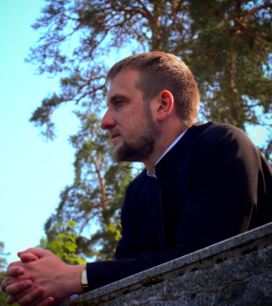

# Yuri Dubovski


## Сontacts
* My telephone number: +375259007737
* [Social network](https://vk.com/id21761644)
* E-mail: y.dubovski92@gmail.com
* Discord: ydubovski
## About me

My current activity is totally unrelated to the IT field. I'm a orthodox priest. I believe that in addition to church activities, it is necessary to develop oneself in something practically significant. My work schedule allows me to combine several professions. I consider myself a fairly goal-oriented person. I hope that RS-School courses will be a good start for me in the IT field.
## Skills
* HTML,CSS

## Code example
``` const Test = require('@codewars/test-compat');

describe("isSquare", function(){
  it("should work for some examples", function(){
    Test.assertEquals(isSquare(-1), false, "-1: Negative numbers cannot be square numbers");
    Test.assertEquals(isSquare( 0), true, "0 is a square number (0 * 0)");
    Test.assertEquals(isSquare( 3), false, "3 is not a square number");
    Test.assertEquals(isSquare( 4), true, "4 is a square number (2 * 2)");
    Test.assertEquals(isSquare(25), true, "25 is a square number (5 * 5)");
    Test.assertEquals(isSquare(26), false, "26 is not a square number");
  });
});
```
## Education
St. Petersburg Theological Academy
## My language
English A1